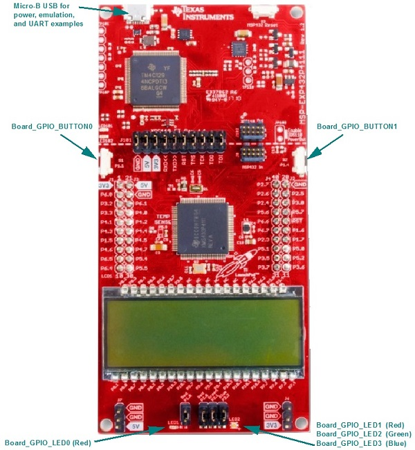

# MSP-EXP432P4111 Settings and Resources

The MSP-EXP432P4111 board contains an MSP432P4111 device.

## Jumper Settings

* Set __RXD &lt;&lt;__ and __TXD &gt;&gt;__ to provide UART communications via the onboard USB debugger.
* If you use a BoosterPack with this board, the BoosterPack fits over J1 and J2.

## Board resources used in driver examples

The following table lists the Board names of the resources used by
the driver examples, and their corresponding pins.  Note that there may be
other resources configured in the board files that are not used by any
driver example.  Only the example resources are listed in the table.

  |Board Resource|Pin|
  |--------------|:---|
  |`Board_ADC0`|P5.5  (Connect to analog signal)|
  |`Board_ADC1`|P5.4  (Connect to analog signal)|
  |`Board_ADCBUF0CHANNEL0`|P5.5  (Connect to analog signal)|
  |`Board_ADCBUF0CHANNEL1`|P5.4  (Connect to analog signal)|
  |`Board_CAPTURE0`|P7.7|
  |`Board_CAPTURE1`|P6.7|
  |`Board_GPIO_LED0`|P1.0  (Red P1.0 must be jumpered)|
  |`Board_GPIO_LED1`|P2.0  (Red P2.0 must be jumpered)|
  |`Board_GPIO_BUTTON0`|P1.1|
  |`Board_GPIO_BUTTON1`|P1.4|
  |`Board_I2C0`|P1.6 - `SDA`, P1.7 - `SCL`  (Some I2C examples require BoosterPacks)|
  |`Board_I2CSLAVE0`|P1.6 - `SDA`, P1.7 - `SCL`|
  |`Board_I2C_TMP`|P6.4 - `SDA`, P6.5 - `SCL`|
  |`Board_PWM0`|P2.1  (Green P2.1 must be jumpered)|
  |`Board_PWM1`|P2.2  (Blue P2.2 must be jumpered)|
  |`Board_SD0`|P1.5 - `CLK`, P1.6 - `MOSI`, P1.7 - `MISO`, P4.6 - `CS`|
  |`Board_SDFatFs0`|P1.5 - `CLK`, P1.6 - `MOSI`, P1.7 - `MISO`, P4.6 - `CS`|
  |`Board_SPI0`|P1.5 - `CLK`, P1.6 - `MOSI`, P1.7 - `MISO`, P1.4 - `STE`|
  |`Board_SPI1`|P3.5 - `CLK`, P3.6 - `MOSI`, P3.7 - `MISO`, P3.4 - `STE`|
  |`Board_SPI2`|P2.5 - `CLK`, P2.6 - `MOSI`, P2.7 - `MISO`, P2.3 - `STE`|
  |`Board_SPI3`|P3.5 - `CLK`, P3.6 - `MOSI`, P3.7 - `MISO`, P2.4 - `STE`|
  |`Board_SPI_CS1`|P5.4|
  |`Board_SPI_CS2`|P5.5|
  |`Board_SPI_MASTER`|P2.5 - `CLK`, P2.6 - `MOSI`, P2.7 - `MISO`, P2.3 - `STE`|
  |`Board_SPI_SLAVE`|P2.5 - `CLK`, P2.6 - `MOSI`, P2.7 - `MISO`, P2.3 - `STE`|
  |`Board_SPI_MASTER_READY`|P5.7|
  |`Board_SPI_SLAVE_READY`|P6.0|
  |`Board_UART0`|P1.2 - `RX`, P1.3 - `TX`  (UART provided through emulation, __RXD &lt;&lt;__ and __TXD &gt;&gt;__ must be jumpered)|

## BoosterPacks

The following examples require BoosterPacks.

  |Example|BoosterPack|
  |-------|:------------|
  |display|[BOOSTXL-SHARP128 LCD & SDCard BoosterPack](http://www.ti.com/tool/boostxl-sharp128)|
  |fatsd|[BOOSTXL-SHARP128 LCD & SDCard BoosterPack](http://www.ti.com/tool/boostxl-sharp128)|
  |fatsdraw|[BOOSTXL-SHARP128 LCD & SDCard BoosterPack](http://www.ti.com/tool/boostxl-sharp128)|
  |i2ctmp116|[BOOSTXL-BASSENSORS BoosterPack](http://www.ti.com/tool/BOOSTXL-BASSENSORS)|
  |i2copt3001\_cpp|[BOOSTXL-BASSENSORS BoosterPack](http://www.ti.com/tool/BOOSTXL-BASSENSORS)|
  |portable|[BOOSTXL-BASSENSORS BoosterPack](http://www.ti.com/tool/BOOSTXL-BASSENSORS)|
  |sdraw|[BOOSTXL-SHARP128 LCD & SDCard BoosterPack](http://www.ti.com/tool/boostxl-sharp128)|

## Peripherals Used

The following list shows which MSP-EXP432P4111 peripherals are used by
driver and kernel applications. Driver examples control which peripherals (and which ports) are used.

* __TI-RTOS Kernel (SYS/BIOS).__ Uses the first general-purpose timer available and that timer's associated interrupts. Generally, this will be Timer\_A0. The TI-RTOS Kernel manages the interrupt controller statically without an interrupt dispatcher.
* __Drivers.__
    * __ADC:__ The ADC driver can use `Board_ADC0` and `Board_ADC1` as defined in the board files. Note that reference voltages are specified in the HW attributes and affect the range of measurable voltages.
    * __I2C:__ The I2C driver is configured on EUSCI_B0 to support various BoosterPacks.
    * __NVS:__ The `Board_NVSINTERNAL` region uses on-chip flash memory. This NVS region is defined in the example application's board file.
    * __PWM:__ The PWM driver uses the onboard RGB LED (G:P2.1 and B:P2.2). These pins are configured for the PWM driver. While these pins can also be used by the GPIO driver, your application's board file must ensure that the pins are not simultaneously used by the GPIO and PWM drivers.
    * __SD:__ The SD driver is built on the GPIO and SPI drivers to communicate with an SD card via SPI.  `Board_SD0` uses `Board_SPI0` to send data to-and-from the SD card.
    * __SDFatFS:__ The SDFatFS driver relies on an SD driver instance to communicate with an SD card; `Board_SDFatFS0` uses the `Board_SD0` driver instance.
    * __SPI:__ The SPI driver is configured to use EUSCI_B0 and EUSCI_B1 for SPI communications.
    * __Timer:__ The Timer, PWM and Capture driver use the timer peripheral.
    * __UART:__ The UART driver uses EUSCI_A0, which is attached to the onboard emulator to facilitate serial communications.
    * __Watchdog:__ The Watchdog driver example uses the Watchdog Timer peripheral.
